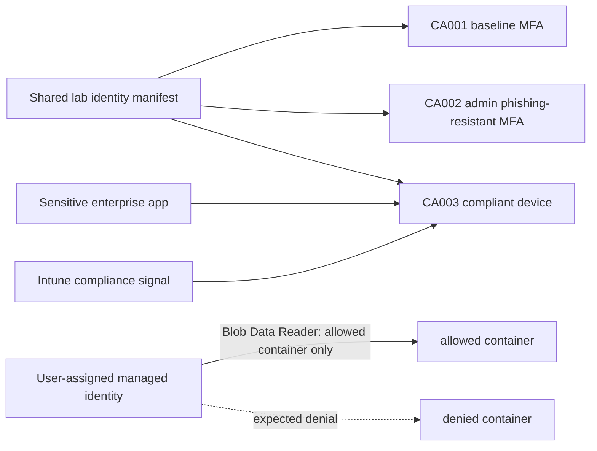

# Zero Trust Identity & Conditional Access Lab

A small, version-controlled Microsoft Entra lab for designing, previewing, testing, and troubleshooting Conditional Access without confusing **report-only evaluation** with enforcement. It is aimed at an interview demonstration and SC-300 practice.

## Current status

Version 0.1 is scaffolded for local use. Three policy definitions, validation, a readable change preview, guarded report-only deployment, tenant export/evidence collection, and a bounded managed-identity workload probe are implemented.

**No tenant or Azure resource changes have been made from this repository.** The checked-in evidence is explicitly synthetic. The compliant-device scenario and workload probe are **designed but unverified** until the prerequisites in [docs/prerequisites.md](docs/prerequisites.md) are met.

| Capability | State | Verification boundary |
|---|---|---|
| Baseline MFA for shared lab users/admins | Designed | Local validation only |
| Phishing-resistant authentication for lab admins | Designed | Local validation only |
| Compliant Windows device for the sensitive app | Designed, unverified | Requires Intune enrollment/compliance signal |
| Report-only Graph deployment | Prepared, never run | Requires tenant role, scopes, and explicit apply flag |
| Managed identity to one Blob container | Designed, unverified | Requires an Azure host and chargeable Storage resources |

## Design



Policy interaction is intentional: a lab administrator accessing the sensitive app must satisfy both CA002's phishing-resistant authentication strength and CA003's compliant-device control. CA001 also applies, but a phishing-resistant MFA method satisfies its ordinary MFA requirement. Emergency access is excluded from all three definitions so recovery does not depend on the controls being repaired.

## Repository map

- `policies/` — deployable Microsoft Graph policy bodies wrapped with review metadata.
- `config/` — non-secret example identifiers and deployment settings. The identity manifest points back to the Enterprise Identity Governance Lab as system of record.
- `src/` — dependency-free policy loading, substitution, comparison, and validation.
- `scripts/` — local preview, guarded Graph deployment/export, evidence collection, and workload probe.
- `tests/` — Python unit tests, fixtures, and the tenant test matrix.
- `docs/` — threat model, policy rationale, prerequisites, rollout, troubleshooting, and recovery.
- `evidence/` — evidence index, completion checklist, and synthetic examples.
- `learning/` — SC-300 mapping and original practice scenarios.
- `infra/` — optional Bicep for the narrowly scoped workload-identity resources.

## Quick start

Requirements for local-only work: Python 3.10+ and no third-party packages.

```powershell
python scripts/validate_policies.py --use-example-config
python scripts/preview_changes.py --use-example-config --current tests/fixtures/current-policies.json
python -m unittest discover -s tests -v
```

Before any tenant work:

1. Copy `config/lab-identities.example.json` to `config/lab-identities.json` and replace every example UUID with the existing shared-object IDs from the Enterprise Identity Governance Lab.
2. Copy `config/tenant.example.json` to `config/tenant.json`; confirm the sensitive resource's application (client) ID and the built-in authentication-strength ID in the target tenant.
3. Complete every prerequisite gate and record shared-tenant coordination in [docs/prerequisites.md](docs/prerequisites.md).
4. Export current policy state and preview. Only then use the separately guarded report-only apply command in [docs/rollout-and-recovery.md](docs/rollout-and-recovery.md).

Enabling a policy is deliberately a different script and requires a tenant-bound policy identity record plus a confirmation phrase containing the policy key and exact Graph ID. Report-only results are evaluation evidence; they are not proof that access was enforced, and creating a report-only policy is still a tenant configuration change.

## Security decisions to defend

- **Explicit pilot groups, not `All users`:** confines blast radius and makes the shared identity boundary visible. A production design should separately evaluate broad coverage gaps.
- **Two authentication levels:** baseline MFA reduces common account takeover; phishing-resistant MFA protects privileged activity from adversary-in-the-middle phishing and MFA fatigue.
- **One control per reason:** the Windows device control is a separate policy, so What If and sign-in logs show why a sign-in would be challenged or blocked. Other platforms are deferred to avoid known report-only certificate prompts without platform-specific testing.
- **Emergency access excluded, monitored, and tested:** exclusion avoids repair-path lockout; strong credentials, alerting, and quarterly drills compensate for the bypass.
- **Human and workload identities are separate:** user MFA policies do not protect service principals. The workload demo uses Azure RBAC and a managed identity with container-scoped read access.
- **Fail-safe rollout:** definitions can only deploy in `enabledForReportingButNotEnforced`; enforcement requires a separate reviewed action after successful tenant tests.

See [REVIEW.md](REVIEW.md) for the independent-review handoff and [evidence/completion-checklist.md](evidence/completion-checklist.md) for the demonstrable path.
