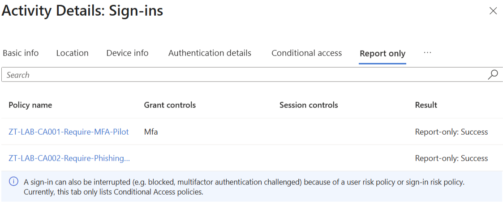
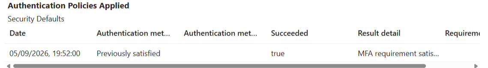

# Observed Conditional Access evidence — 5 September 2026

Two policies were deployed in report-only mode and read back from Microsoft Graph. The supplied Entra portal screenshot shows **Report-only: Success** for both CA001 and CA002. Neither policy has been enabled for enforcement.

This is the original user-supplied screenshot, copied without alteration. It contains no visible real administrator email, tenant ID, credentials or QR code. CA002's name is truncated by the portal. The screenshot does not show a sign-in ID, so exact correlation to the exported event remains outstanding.

## Three live What If evaluations

| Persona | Resource / assumed client | CA001 applies | CA002 applies |
|---|---|---|---|
| Lab administrator | Azure Resource Manager / Windows browser | Yes | Yes |
| Liam, ordinary lab user | Same | Yes | No: user scope |
| Sofia, disabled and removed from lab groups | Same | No: user scope | No: user scope |

The resource application was verified against an observed Azure Portal sign-in and its tenant service principal. Sofia's row is a **hypothetical applicability check**, not a successful sign-in; the account remains disabled. Application authorization and device compliance are not established by What If.

- [Redacted configuration readback](configuration.redacted.json)
- [Redacted What If inputs and results](what-if.redacted.json)
- [Private source hashes](source-hashes.json)

## Authentication and evidence limitations

The second supplied screenshot shows Security Defaults and a successful **Previously satisfied** authentication step. It does not identify the original method or passkey provider. Passkey registration/use is operator-reported; a fresh method-specific passkey event was not captured, and the operator deferred repeating that test.

The CLI sign-in export returned three records but no lab-policy details, despite the portal screenshot. This API/portal discrepancy is unresolved. The screenshot is retained as portal evidence; no fabricated JSON policy results were added. A read-only SDK export with both policy and audit scopes is prepared for the next interactive session.

CA003 is not deployed. Its prepared target is the verified Azure Resource Manager application; Intune licensing, a compliant Windows device and negative device tests remain outstanding. Recovery drills, enforcement, and the Azure workload demonstration are also unrun.

These curated files omit tenant/user/group/policy object IDs and original network/location data. Raw private exports are not committed. Hashes provide change detection, not independently authenticated provenance.
